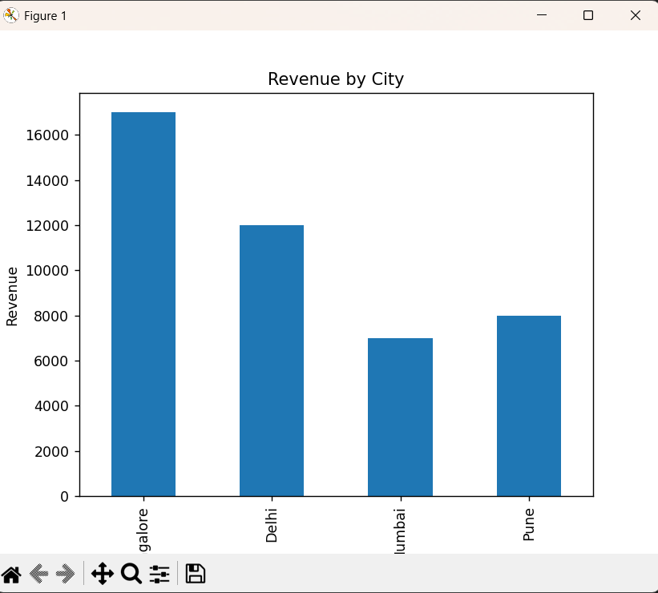
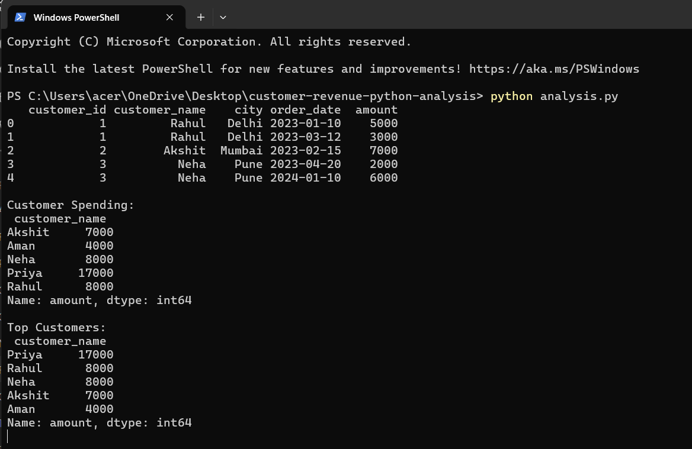

# Customer Revenue Analysis (Python)

## Tools Used :
* Python
* Pandas
* Matplotlib

## Description :
This project analyzes customer transaction data using Python to understand revenue trends, customer spending patterns, and city-wise performance.

## Key Analysis :
* Customer spending analysis
* Identification of top customers
* Revenue distribution by city
* Data visualization using bar charts

## 📊 Output :

### Revenue by City :

### Terminal Output :

## 📁 Project Files :
* `analysis.py` – Python script for data analysis
* `customer_revenue_analysis.xlsx` – Dataset used for analysis
* `assets/` – Output screenshots

## Conclusion :
This project demonstrates how Python can be used for data analysis and visualization to extract meaningful business insights from customer data.
